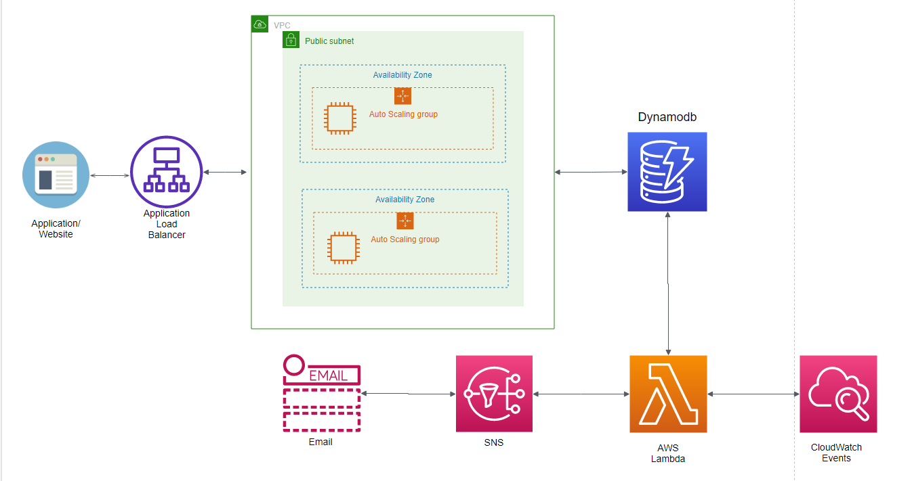

<p align="center">
  <a href="" rel="noopener">
 </a>
</p>

<h3 align="center">Quote-of-the-Day</h3>

---

<p align="center"> A simple website deployed using AWS services
    <br> 
</p>

## 📝 Table of Contents
- [About](#about)
- [AWS Architecture](#architecture)
- [Getting Started](#getting_started)
- [Deployment](#deployment)
- [Acknowledgments](#acknowledgement)

## 🧐 About <a name = "about"></a>
A Quote-of-the-day website which display a new quote each time you load the website. It has a feature to send a daily email containing a random quote to you every morning.  

## ⛏️  AWS Architecture <a name = "architecture"></a>




Above is a general overview of the architecture.

## 🏁 Getting Started <a name = "getting_started"></a>

### Prerequisites

- An AWS Account; you can get a free tier for 1 year which will be more than enough to start 
- Knowledge of Python 
- Familiar with HTML/CSS/PHP 

### Installing

Assuming you have the lastest version of Python 3, install the following Python SDK 
 ```
 pip install boto3
 ```
[Documentation of boto3 to get you started](https://boto3.amazonaws.com/v1/documentation/api/latest/index.html)    


## 🚀 Deployment <a name = "deployment"></a>

## Creating A Dynamodb table
In this first step, we will be creating a DynamoDB table to use as a database to store our quotes.

  Using the AWS Management Console, navigate to the DynamoDB service    
  
  - Create a table name 'Quotes' with 'id' as the partition key.  
  
  - In order to create items in the table, we make use of [CreateTable.py](https://github.com/pjx98/Quote-of-the-day/blob/master/CreateTable.py) file.  
  
  - If you want to add more items to the table, modifiy the following lines of codes in the following order:  
  'id', 'Quote', 'Author'
   ```
  quotes_resp = put_quotes(1, '"Live as if you were to die tomorrow. Learn as if you were to live forever"', 'Mahatma Gandhi')
  
  quotes_resp = put_quotes(2, '"That which does not kill us makes us stronger"', 'Friedrich Nietzsche')
  
  quotes_resp = put_quotes(3, '"Be who you are and say what you feel, because those who mind don’t matter and those who matter don’t mind"', 'Bernard M. Baruch')
  
  quotes_resp = put_quotes(4, '"We must not allow other people’s limited perceptions to define us."', 'Virginia Satir')
  
  quotes_resp = put_quotes(5, '"Do what you can, with what you have, where you are."', 'Theodore Roosevelt' ) 
  ```
Once you are satisifed, run the file to add the items to the table. Return to  where you created the table and refresh the page. You should see the updated items.

[More information on how to create, add or query a Dynamodb Table.](https://docs.aws.amazon.com/amazondynamodb/latest/developerguide/GettingStarted.Python.html)
 
## Creating our website 

[index.php](https://github.com/pjx98/Quote-of-the-day/blob/master/index.php) is what we will be using as our website. Within the file, we have to call the  [ReadTable.py](https://github.com/pjx98/Quote-of-the-day/blob/master/ReadTable.py) which will read the data from our dynamoDB table and display them on our website as quotes.  

If you want to create and style your own website, just remember to add in the following lines of code to read the data from the table.
```
<?php
    $output=shell_exec('python ReadTable.py');
    echo "<pre>";
    print_r($output);
    echo "</pre>";
?>
```
## Elastic Beanstalk

Once we are satisfied with our website, we are ready to deploy them onto Elastic Beanstalk.  
 
 Elastic Beanstalk helps us to automate the provisioning of EC2 instances with high availability and auto-scaling features. All we need to do is to provide our code which is [index.php](https://github.com/pjx98/Quote-of-the-day/blob/master/index.php).  

 Using the AWS Management console, navigate to Elastic Beanstalk.
 
 - Choose **Create a new environment** and select **Web server environment**
 - Fill in your application name and environment name 
 - Under **Platform**, choose PHP
 - Under **Application code**, choose sample code
 - Click on **More configurations**
 - Choose **High availability** under **Presets**
 - Click **Create**
 - Upload the [EB.zip](https://github.com/pjx98/Quote-of-the-day/blob/master/EB.zip) file

Within the EB.zip file, there is a folder called .ebextensions with a file named python.config. This is to ensure that we install python3 as well as the python SDK, boto3 before deploying the website.

If we receive a green tick with health OK, it means that our deployment suceeded.

Following that, we need to navigate to where our EC2 instance is stored and add in the following policy to its IAM Role: AmazonDynamoDBFullAccess. This ensures that our website has the neccessary permissons to access the DynamoDB table.

Go back to Elastic Beanstalk and click on the application domain name, for eg: QuoteOfTheDay-env.eba-srvtxtu8.ap-southeast-1.elasticbeanstalk.com to access your website, 

## SNS 

SNS is a pub/sub service where we are able to subscribe to many 'consumers' using a single 'topic'. We will be using SNS mainly to push the output of our lambda function to our email.  

Using the AWS Managment console, navigate to SNS.

- Choose a name for your topic and click **Create**.
- Choose '**Create Subscription**'
- Under **Protocol**, choose **Email** and key in the email address which you want to receive daily quotes from.

## AWS Lambda 

AWS Lambda is one of the most widely used service within AWS. It allows you to create functions, transform data etc.

For this case, we will be using Lambda to execute a function to read from our dynamoDB table and push the output to SNS, and in turn SNS will push the message to our email.

Using AWS Management console, navigate to Lambda

- Choose **Create function**
- Select '**Author from scratch**'
- Give a name and under **Runtime**, select **Python**
- Choose **Create function**
- Copy and paste the contents of the [lambda.py](https://github.com/pjx98/Quote-of-the-day/blob/master/lambda.py) onto the function code.
- Modify the value of the 'TopicARN' to the ARN of your SNS.  
 Eg,
 ```
 client.publish(TopicArn='Your_SNS_ARN',
 Message = "Here's your quote for the day!\n \n" + Quote + ' - ' + Author)
```
- Go the the **Permissions** and click on the **Role name**
- Attach the following policies: **CloudWatchFullAccess, AmazonDynamoDBReadOnlyAccess, AmazonSNSReadOnlyAccess, AmazonSNSRole.**
- Test your function
- It should return succeeded.
- Go to your email and check if you receive the message.

## CloudWatch

We will be using Cloudwatch Events to automate/schedule the invocation of our Lambda function to a particular time that we want, for eg every morning at 8am.

Using the AWS Management console, navigate to CloudWatch

- choose **Events**, **Create rule**.
- For **Event source**, choose **Schedule**
- Modify the cron expression to '0 0 * * ? *' 
- For **Targets**, choose **Add target**, **Lambda function**
- For **Function**, select the Lambda function that you created.
- Choose **Configure details**.
- For **Rule Definition**, type a name and description for the rule.
- Choose **Create rule**

For the cron expression, you can set to any time that you want, for eg daily, weekly or at a particular time etc.

[Read more on how to schedule CloudWatch Events with Lambda](https://docs.aws.amazon.com/AmazonCloudWatch/latest/events/RunLambdaSchedule.html)


## 🎉 Acknowledgements <a name = "acknowledgement"></a>
- My inspiration comes from: https://www.reddit.com/r/sysadmin/comments/8inzn5/so_you_want_to_learn_aws_aka_how_do_i_learn_to_be/


